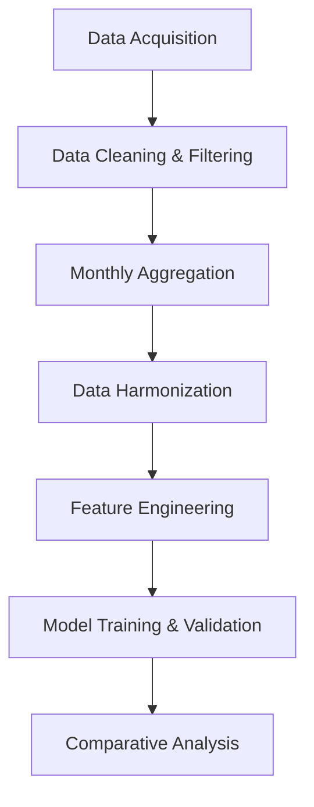

Absolutely! Here is a **detailed, in-depth methodology manuscript** suitable for both peer review and supplementary information. This version provides comprehensive explanations, step-by-step logic, and expanded rationale for each component of the pipeline.

---

# Methodology

## 1. Introduction

Accurate estimation of ambient PM₂.₅ concentrations is critical for air quality management and health impact assessment. This study presents a comprehensive modeling pipeline that integrates ground-based measurements, satellite-derived PM₂.₅, and meteorological reanalysis data. The pipeline is designed to ensure data quality, temporal consistency, and robust model evaluation, making it suitable for both scientific publication and practical deployment.

---

## 2. Data Sources and Preprocessing

### 2.1 Ground Station Data

#### 2.1.1 Data Acquisition

- **Source:** Central Pollution Control Board (CPCB), India.
- **Temporal Resolution:** Raw data is collected at 15-minute intervals for the period 2019–2023.
- **Variables:** PM₂.₅ concentrations from multiple monitoring stations across selected cities.

#### 2.1.2 Data Cleaning and Quality Control

- **Tool Used:** AirPy, an open-source air quality data cleaning toolkit.
- **Process:**
  - Removal of physically implausible values (e.g., negative concentrations).
  - Handling of missing or duplicate timestamps.
  - Standardization of time zones and formats.

#### 2.1.3 Monthly Aggregation

- **Rationale:** To harmonize with satellite and meteorological data, all sources are aggregated to a monthly temporal resolution.
- **Method:**
  - For each station, calculate the monthly mean PM₂.₅.
  - Compute the percentage of valid (non-missing) data points per month.

#### 2.1.4 Data Availability Filtering

- **Threshold:** Months with less than 50% data availability are excluded.
- **Justification:** Ensures that monthly means are based on sufficient observations, reducing bias from sparse data.

#### 2.1.5 Intersite Correlation Filtering

- **Method:** For each station, compute the Pearson correlation coefficient of its monthly PM₂.₅ series with all other stations in the same city.
- **Criterion:** Stations with correlation <0.5 with multiple other stations are excluded.
- **Purpose:** Removes stations with anomalous or unrepresentative readings, improving spatial reliability.

#### 2.1.6 Output

- **Processed Ground Data:** High-quality, monthly-aggregated PM₂.₅ data for each city, ready for integration with other data sources.

---

### 2.2 Satellite-Derived PM₂.₅ Data

#### 2.2.1 Data Acquisition

- **Source:** Washington University Satellite-Derived PM₂.₅ Dataset.
- **Temporal Coverage:** 1998–2023.
- **Spatial Resolution:** Gridded data, typically at 0.01°–0.1°.

#### 2.2.2 Spatial Subsetting

- **Method:** Use city bounding boxes (min_lon, min_lat, max_lon, max_lat) derived from shapefiles to extract relevant grid cells for each city.

#### 2.2.3 Temporal Aggregation

- **Process:** Aggregate daily or higher-frequency satellite PM₂.₅ estimates to monthly means for each city.

#### 2.2.4 Output

- **Satellite Data:** City-level, monthly-mean PM₂.₅ estimates, temporally aligned with ground and meteorological data.

---

### 2.3 Meteorological Data

#### 2.3.1 Data Acquisition

- **Source:** ERA5 Reanalysis, Copernicus Data Store (CDS).
- **Temporal Coverage:** 1998–2023.
- **Variables:**  
  - U10, V10: Zonal and meridional wind (10m)
  - WS: Wind Speed
  - WD: Wind Direction
  - SP: Surface Pressure
  - BLH: Boundary Layer Height
  - TCC: Total Cloud Cover
  - T2M, D2M: Temperature & Dewpoint (2m)
  - RH: Relative Humidity
  - SSR: Surface Solar Radiation
  - TP: Total Precipitation

#### 2.3.2 Spatial and Temporal Processing

- **Spatial Subsetting:** Extract data for each city using bounding boxes.
- **Temporal Aggregation:** Aggregate to monthly means to match other datasets.

#### 2.3.3 Output

- **Meteorological Data:** City-level, monthly-mean meteorological variables.

---

### 2.4 Data Harmonization and Master Dataset Creation

#### 2.4.1 Merging Datasets

- **Join Keys:** `[year, month]` for each city.
- **Result:** A master dataset with the following columns:
  ```
  [year, month, U10, V10, WS, WD, SP, BLH, TCC, T2M, D2M, RH, SSR, TP, PM2.5]
  ```

#### 2.4.2 Ensuring Temporal Consistency

- All data sources are aligned at the monthly level, ensuring that each row represents a unique city-month.

#### 2.4.3 Example Row

| year | month | U10 | V10 | WS | WD | SP | BLH | TCC | T2M | D2M | RH | SSR | TP | PM2.5 |
|------|-------|-----|-----|----|----|----|-----|-----|-----|-----|----|-----|----|-------|
| 2020 |  1    | ... | ... | .. | .. | .. | ... | ... | ... | ... | .. | ... | .. |  65.2 |

---

## 3. Model Development and Evaluation

### 3.1 Feature Engineering

- **Input Features:** `[U10, V10, WS, WD, SP, BLH, TCC, T2M, D2M, RH, SSR, TP]`
- **Target Variable:** `PM2.5`
- **Optional:** Additional features such as month (seasonality), lagged variables, or interaction terms can be engineered as needed.

### 3.2 Model Selection

A diverse set of machine learning models is employed to capture both linear and nonlinear relationships:

#### 3.2.1 Linear Models

- **Ridge Regression:** L2 regularization, robust to multicollinearity.
- **Lasso Regression:** L1 regularization, performs feature selection.
- **ElasticNet Regression:** Combines L1 and L2 penalties.

#### 3.2.2 Tree-Based Models

- **Decision Tree Regressor:** Simple, interpretable, prone to overfitting.
- **Random Forest Regressor:** Ensemble of trees, reduces variance, robust to overfitting.
- **Extra Trees Regressor:** More randomization, faster, sometimes less stable.
- **HistGradientBoosting Regressor:** Efficient, handles missing data.
- **XGBoost Regressor:** Gradient boosting, high accuracy, fast.
- **LightGBM Regressor:** Gradient boosting, efficient for large datasets.
- **CatBoost Regressor:** Handles categorical/missing data, robust to overfitting.

#### 3.2.3 Other Models

- **K-Nearest Neighbors (KNN) Regressor:** Non-parametric, simple, slow for large data.
- **Multi-Layer Perceptron (MLP) Regressor:** Neural network, captures complex patterns.
- **Support Vector Regressor (SVR):** Effective in high dimensions, sensitive to scaling.
- **Generalized Additive Model (GAM):** Flexible, interpretable, additive effects.
- **Keras-based RNN Models:** Captures temporal dependencies, suitable for time series.

### 3.3 Model Training and Validation

#### 3.3.1 Data Splitting

- **Approach:** Data is split into training and test sets, either by city (spatial holdout) or by time (temporal holdout), to assess generalizability.

#### 3.3.2 Hyperparameter Optimization

- **Method:** Grid search or Bayesian optimization with cross-validation.
- **Example:** For Random Forest, tune `n_estimators`, `max_depth`, `min_samples_split`, etc.

#### 3.3.3 Model Evaluation

- **Metrics:**  
  - R² (Coefficient of Determination)
  - RMSE (Root Mean Squared Error)
  - MAE (Mean Absolute Error)
- **Interpretation:**  
  - R² indicates the proportion of variance explained.
  - RMSE and MAE provide error magnitudes in physical units.

#### 3.3.4 Example: Random Forest Regressor

```python
from sklearn.ensemble import RandomForestRegressor
from sklearn.model_selection import train_test_split, GridSearchCV

# X: features, y: PM2.5
X_train, X_test, y_train, y_test = train_test_split(X, y, test_size=0.2, shuffle=True)
param_grid = {'n_estimators': [100, 200], 'max_depth': [10, 20]}
rf = GridSearchCV(RandomForestRegressor(), param_grid, cv=5)
rf.fit(X_train, y_train)
y_pred = rf.predict(X_test)
```

---

## 4. Comparative Model Analysis

### 4.1 Model Strengths and Weaknesses

| Model Type         | Strengths | Weaknesses | Best Use Cases |
|--------------------|-----------|------------|---------------|
| Ridge/Lasso/ElasticNet | Fast, interpretable, baseline | May underfit | Feature selection, baseline |
| Decision Tree      | Interpretable, non-linear | Overfits | Exploratory analysis |
| Random Forest      | Robust, handles non-linearity | Less interpretable | General-purpose |
| Extra Trees        | Fast, more random | Less stable | Large datasets |
| HistGradientBoosting | Efficient, missing data | Complex tuning | Tabular data |
| XGBoost/LightGBM   | High accuracy, fast | Complex, tuning | Competitions, production |
| CatBoost           | Categorical/missing data | Slower | Real-world tabular data |
| KNN                | Simple, non-parametric | Slow, local | Small datasets |
| MLP Regressor      | Captures complex patterns | Overfits, tuning | Nonlinear relationships |
| SVR                | High-dim, complex | Slow, scaling | Small, complex data |
| GAM                | Flexible, interpretable | Misses interactions | Additive effects |
| Keras RNN          | Temporal dependencies | Needs large data | Time series |

### 4.2 Feature Importance

- **Tree-based models** provide feature importance scores (e.g., Gini importance).
- **Lasso** can shrink coefficients to zero, highlighting key predictors.
- **Interpretation:** Helps identify meteorological drivers of PM₂.₅.

---

## 5. Model Pipeline Workflow Diagram



### Component Descriptions

- **Data Acquisition:** Collects raw data from ground stations, satellites, and meteorological sources.
- **Data Cleaning & Filtering:** Ensures data quality via cleaning, availability, and correlation filters.
- **Monthly Aggregation:** Aggregates all data to monthly means for temporal consistency.
- **Data Harmonization:** Merges datasets on `[year, month]` for each city.
- **Feature Engineering:** Prepares input features and target variable for modeling.
- **Model Training & Validation:** Trains and evaluates multiple models using cross-validation and hyperparameter tuning.
- **Comparative Analysis:** Compares model performance and interprets results.

---

## 6. Variable Description Table

| Variable | Description | Unit |
|----------|-------------|------|
| PM₂.₅    | Particulate Matter (2.5 μm) | μg/m³ |
| U10, V10 | Zonal/meridional wind (10m) | m/s |
| WS       | Wind Speed | m/s |
| WD       | Wind Direction | Degree (0–360) |
| SP       | Surface Pressure | hPa |
| BLH      | Boundary Layer Height | m |
| TCC      | Total Cloud Cover | 0–1 |
| T2M, D2M | Temperature & Dewpoint (2m) | K |
| RH       | Relative Humidity | % |
| SSR      | Surface Solar Radiation | kWh/m² |
| TP       | Total Precipitation | m |

---

## 7. Frequently Asked Questions (FAQ) with Robust Answers

**Q1. How is the reliability of ground station data ensured?**  
**A:** Reliability is ensured by a two-stage filtering process: (1) months with <50% data availability are excluded, and (2) stations with low intersite correlation (Pearson r < 0.5) are removed. This dual filter removes both temporally and spatially unreliable data.

**Q2. Why aggregate all data to monthly means?**  
**A:** Monthly aggregation harmonizes the temporal resolution across ground, satellite, and meteorological data, reducing noise and ensuring comparability.

**Q3. How are missing values handled in the dataset?**  
**A:** Missing values are addressed during preprocessing (e.g., AirPy cleaning, monthly aggregation). Some models (e.g., CatBoost, HistGradientBoosting) can natively handle missing values, while others use imputation.

**Q4. What is the rationale for the 50% data availability threshold?**  
**A:** This threshold ensures that monthly means are based on a sufficient number of observations, reducing the risk of bias from sparse or irregular data.

**Q5. How is overfitting addressed in the modeling pipeline?**  
**A:** Overfitting is mitigated through cross-validation, regularization (in linear models), and ensemble methods (e.g., Random Forest, XGBoost). Hyperparameter tuning further optimizes model complexity.

**Q6. How are hyperparameters selected for each model?**  
**A:** Hyperparameters are optimized using grid search or Bayesian optimization with cross-validation, maximizing performance metrics on validation sets.

**Q7. How is model performance evaluated and compared?**  
**A:** Models are evaluated using R², RMSE, and MAE on held-out test data. Comparative analysis identifies the most robust and generalizable model.

**Q8. How are spatial and temporal dependencies handled?**  
**A:** Temporal dependencies are partially captured by including lagged features or using RNNs. Spatial dependencies are addressed by filtering unreliable stations and using city-level bounding boxes.

**Q9. How is feature importance interpreted and used?**  
**A:** Feature importance is derived from model-specific methods (e.g., Gini importance in Random Forest, coefficients in Lasso). This helps identify key meteorological drivers of PM₂.₅ and guides further research.

**Q10. Can this pipeline be generalized to other regions or pollutants?**  
**A:** Yes, the pipeline is modular and can be adapted to other regions or pollutants by updating data sources, variables, and model parameters as needed.

---

## 8. Conclusion

This methodology provides a transparent, reproducible, and scientifically rigorous approach for integrating multi-source data and advanced machine learning models to estimate PM₂.₅ concentrations. The pipeline's modular design, robust data quality controls, and comprehensive model evaluation make it suitable for both research and operational air quality management.

---

*This detailed methodology is intended to serve as both the main methods section and supplementary information for peer-reviewed publication.*
```
If you need further expansion on any section (e.g., more code, more mathematical details, or additional diagrams), let me know!