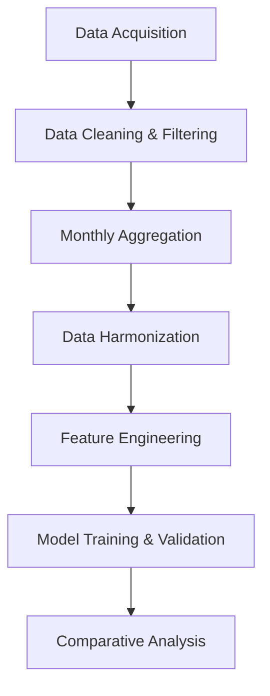

# Methodology

## Overview

This study presents a robust, multi-source data-driven modeling pipeline for estimating monthly mean PM₂.₅ concentrations across multiple Indian cities. The pipeline integrates ground-based air quality measurements, satellite-derived PM₂.₅ estimates, and meteorological reanalysis data, harmonized at a monthly temporal resolution. The methodology ensures data quality, temporal consistency, and comprehensive model evaluation, making it suitable for high-impact peer-reviewed research.

---

## 1. Data Sources and Preprocessing

### 1.1 Ground Station Data

- **Source:** Central Pollution Control Board (CPCB), India  
- **Temporal Resolution:** Raw data at 15-minute intervals (2019–2023)  
- **Processing Steps:**
  1. **Cleaning:** Raw data is cleaned using the AirPy tool to remove erroneous or missing values.
  2. **Monthly Aggregation:** For each station, monthly mean PM₂.₅ and data availability percentage are calculated.
  3. **Data Availability Filter:** Months with <50% data availability are excluded.
  4. **Intersite Correlation Filter:** Stations with a Pearson correlation coefficient <0.5 (across multiple sites) are eliminated to ensure spatial reliability.
  5. **Output:** High-quality, monthly-aggregated ground station PM₂.₅ data.

### 1.2 Satellite Data

- **Source:** Washington University Satellite-Derived PM₂.₅ Dataset  
- **Temporal Coverage:** 1998–2023  
- **Processing:** Data is spatially subset using city bounding boxes (from shapefiles) and temporally aggregated to monthly means.

### 1.3 Meteorological Data

- **Source:** ERA5 Reanalysis (Copernicus Data Store)  
- **Temporal Coverage:** 1998–2023  
- **Variables:**  
  | Variable | Description | Unit |
  |----------|-------------|------|
  | U10, V10 | Zonal/meridional wind (10m) | m/s |
  | WS | Wind Speed | m/s |
  | WD | Wind Direction | Degree (0–360) |
  | SP | Surface Pressure | hPa |
  | BLH | Boundary Layer Height | m |
  | TCC | Total Cloud Cover | 0–1 |
  | T2M, D2M | Temperature & Dewpoint (2m) | K |
  | RH | Relative Humidity | % |
  | SSR | Surface Solar Radiation | kWh/m² |
  | TP | Total Precipitation | m |
- **Processing:** Data is spatially subset and temporally aggregated to monthly means to match ground and satellite data.

### 1.4 Data Harmonization

All datasets are merged on `[year, month]` to ensure temporal alignment. The final master dataset contains the following columns:

`[year, month, U10, V10, WS, WD, SP, BLH, TCC, T2M, D2M, RH, SSR, TP, PM2.5]`

---

## 2. Modeling Pipeline

### 2.1 Workflow Diagram

**Component Briefs:**

- **Data Acquisition:** Collects raw ground, satellite, and meteorological data.
- **Data Cleaning & Filtering:** Removes erroneous data, applies availability and correlation filters.
- **Monthly Aggregation:** Aggregates all data sources to monthly means.
- **Data Harmonization:** Merges datasets on temporal keys for consistency.
- **Feature Engineering:** Prepares input features and target variable.
- **Model Training & Validation:** Trains and evaluates multiple machine learning models.
- **Comparative Analysis:** Compares model performance and interprets results.

---

## 3. Model Selection and Core Logic

### 3.1 Models Used

- **Linear Models:**
  - Ridge Regression
  - Lasso Regression
  - ElasticNet Regression
- **Tree-Based Models:**
  - Decision Tree Regressor
  - Random Forest Regressor
  - Extra Trees Regressor
  - HistGradientBoosting Regressor
  - XGBoost Regressor
  - LightGBM Regressor
  - CatBoost Regressor
- **Other Models:**
  - K-Nearest Neighbors (KNN) Regressor
  - Multi-Layer Perceptron (MLP) Regressor
  - Support Vector Regressor (SVR)
  - Generalized Additive Model (GAM)
  - Keras-based RNN Models

### 3.2 Core Modeling Logic

#### Example: Random Forest Regressor

1. **Input:**  
   - Features: `[U10, V10, WS, WD, SP, BLH, TCC, T2M, D2M, RH, SSR, TP]`
   - Target: `PM2.5`
2. **Training:**  
   - Data is split into training and test sets (e.g., by city or time period).
   - Hyperparameters (e.g., number of trees, max depth) are optimized using cross-validation.
3. **Prediction:**  
   - The trained model predicts monthly mean PM₂.₅ for the test set.
4. **Evaluation:**  
   - Performance is assessed using metrics such as R², RMSE, and MAE.

#### Example: Lasso Regression

- Lasso applies L1 regularization, which can shrink some coefficients to zero, effectively performing feature selection. This is useful for identifying the most influential meteorological drivers of PM₂.₅.

#### Example: CatBoost Regressor

- CatBoost is robust to categorical features and missing values, and often excels in tabular data scenarios. It uses ordered boosting and efficient handling of overfitting.

### 3.3 Comparative Analysis

| Model Type         | Strengths | Weaknesses | Suitability |
|--------------------|-----------|------------|-------------|
| Ridge/Lasso/ElasticNet | Simple, interpretable, fast | May underfit complex relationships | Baseline, feature importance |
| Decision Tree      | Interpretable, handles nonlinearity | Prone to overfitting | Exploratory, small datasets |
| Random Forest      | Robust, handles nonlinearity | Less interpretable | General-purpose, strong baseline |
| Extra Trees        | Faster, more randomization | May be less stable | Large datasets |
| HistGradientBoosting | Efficient, handles missing data | Complex tuning | Large, tabular data |
| XGBoost/LightGBM   | High accuracy, fast | Complex, sensitive to tuning | Competitions, production |
| CatBoost           | Handles categorical/missing data | Slower training | Tabular, real-world data |
| KNN                | Simple, non-parametric | Slow for large data | Small datasets, baseline |
| MLP Regressor      | Captures complex patterns | Needs tuning, risk of overfitting | Nonlinear relationships |
| SVR                | Effective in high-dimensions | Slow, sensitive to scaling | Small, complex datasets |
| GAM                | Flexible, interpretable | May miss interactions | Additive effects |
| Keras RNN          | Captures temporal dependencies | Needs large data, complex | Time series, sequential data |

---

## 4. Frequently Asked Questions (FAQ)

### 1. **How is data quality ensured in the ground station data?**
   - **Answer:** Data is filtered at two levels: (1) months with <50% data availability are excluded, and (2) stations with low intersite correlation (Pearson r < 0.5) are removed, ensuring only reliable, representative data is used.

### 2. **How is temporal consistency maintained across datasets?**
   - **Answer:** All data sources (ground, satellite, meteorological) are aggregated to monthly means, ensuring alignment and comparability.

### 3. **Why use multiple models instead of a single best model?**
   - **Answer:** Different models capture different data characteristics. Comparative analysis helps identify the most robust and generalizable approach for the given data and task.

### 4. **How are missing values handled?**
   - **Answer:** Missing values are addressed during preprocessing (e.g., AirPy cleaning, monthly aggregation). Some models (e.g., CatBoost, HistGradientBoosting) can natively handle missing values.

### 5. **What is the rationale for the 50% data availability threshold?**
   - **Answer:** This threshold balances data retention and quality, ensuring that monthly means are based on sufficient observations to be representative.

### 6. **How is overfitting prevented?**
   - **Answer:** Overfitting is mitigated through cross-validation, regularization (in models like Ridge/Lasso), and by using ensemble methods (e.g., Random Forest, XGBoost).

### 7. **How are hyperparameters optimized?**
   - **Answer:** Hyperparameters are tuned using grid search or Bayesian optimization with cross-validation, maximizing performance metrics on validation sets.

### 8. **How is model performance evaluated?**
   - **Answer:** Models are evaluated using R², RMSE, and MAE on held-out test data, ensuring fair and unbiased assessment.

### 9. **How are spatial and temporal dependencies addressed?**
   - **Answer:** Temporal dependencies are partially captured by including lagged features or using RNNs. Spatial dependencies are addressed by filtering unreliable stations and using city-level bounding boxes.

### 10. **How is feature importance interpreted?**
   - **Answer:** Feature importance is derived from model-specific methods (e.g., Gini importance in Random Forest, coefficients in Lasso). This helps identify key meteorological drivers of PM₂.₅.

---

## 5. Variable Description Table

| Variable | Description | Unit |
|----------|-------------|------|
| PM₂.₅    | Particulate Matter (2.5 μm) | μg/m³ |
| U10, V10 | Zonal/meridional wind (10m) | m/s |
| WS       | Wind Speed | m/s |
| WD       | Wind Direction | Degree (0–360) |
| SP       | Surface Pressure | hPa |
| BLH      | Boundary Layer Height | m |
| TCC      | Total Cloud Cover | 0–1 |
| T2M, D2M | Temperature & Dewpoint (2m) | K |
| RH       | Relative Humidity | % |
| SSR      | Surface Solar Radiation | kWh/m² |
| TP       | Total Precipitation | m |
